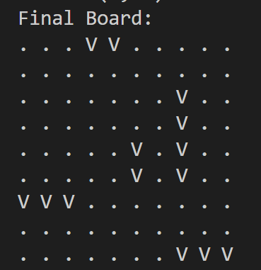
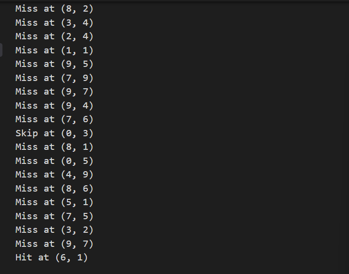

# Submarine Placement and Search Program🚢🚀

## Prerequisites

### Software Requirements
- Docker Desktop
- Git (recommended)

### Supported Platforms
- Windows 10/11
- macOS
- Linux

## Installation Steps

### 1. Clone the Repository
```bash
git clone https://github.com/YaelRov/Submarine-Placement-Game
cd submarine_placement_program
```

### Alternative: Manual Download
1. Visit https://github.com/YaelRov/Submarine-Placement-Game
2. Click "Code" > "Download ZIP"
3. Extract the downloaded ZIP file
4. Open terminal/command prompt in extracted folder

### 2. Docker Installation and Setup

#### Windows
1. Install Docker Desktop
   - Download from: https://www.docker.com/products/docker-desktop
   - Follow installation wizard
2. Ensure WSL 2 is installed and configured

#### macOS
1. Install Docker Desktop
   - Download from: https://www.docker.com/products/docker-desktop
   - Drag to Applications folder
2. Launch Docker Desktop

#### Linux
```bash
# Ubuntu/Debian example
sudo apt-get update
sudo apt-get install docker.io docker-compose
```

## Running the Program

### Build Docker Image
Open terminal/command prompt in project directory:
```bash
docker build -t submarine-app .
```

### Run the Application

#### Windows
```powershell
docker run -it --rm -v "C:\submarine_placement_program:/app" -w /app submarine-app
```

#### macOS/Linux
```bash
docker run -it --rm -v $(pwd):/app -w /app submarine-app
```

## Example Screenshots

### Final Game Board


### Game Log


## Performance Notes
- 4 concurrent search threads
- Supports configurable board sizes
- Memory-mapped file logging

## Contributors

- Yael Rov ([@YaelRov](https://github.com/YaelRov))
- Yael Taub ([@YAEL-TAUB](https://github.com/YAEL-TAUB))
- Tsipi Wajsberg ([@tsw1212](https://github.com/tsw1212))
- Tiferet Maimon ([@TiferetM](https://github.com/TiferetM))
